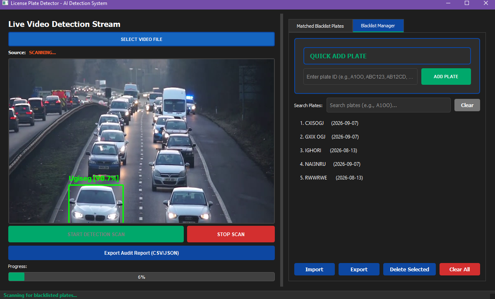

# License Plate Detector

AI-powered license plate detection and blacklist matching system with live video preview, real-time plate recognition, and automatic alerting for blacklisted vehicles.

## Features

- **Live Video Detection**: Real-time video stream analysis with bounding box visualization
- **Blacklist Matching**: Automatically matches detected plates against your blacklist
- **Live Preview**: Green boxes for normal plates, red boxes for blacklist matches
- **Matched Plate Gallery**: View all matched plates with thumbnails, confidence scores, and timestamps
- **Image Export**: Export matched vehicle images with full context for security tracking
- **Audit Reports**: Export detection results as CSV or JSON with accompanying image folders
- **Dark Professional UI**: Modern dark-themed interface with progress tracking
- **Batch Processing**: Process entire video files with frame-by-frame analysis

## Installation

```bash
# Clone the repository
git clone https://github.com/Thilankalhara/AI-powered-license-plate-detector.git
cd AI-powered-license-plate-detector

# Create virtual environment
python -m venv venv

# Activate virtual environment
# Windows:
venv\Scripts\activate
# Linux/Mac:
source venv/bin/activate

# Install dependencies
pip install -r requirements.txt
```

## Screenshot



## Usage

```bash
# Run the professional GUI application
python professional_app.py

# Or use the setup script
python setup.py
```

## How It Works

1. **Add Blacklist Plates**: Enter license plates you want to monitor in the Blacklist Manager
2. **Select Video**: Choose a video file for analysis
3. **Start Detection**: Click "START DETECTION SCAN" to begin processing
4. **View Results**: 
   - Live preview shows green boxes for all detected plates
   - Red boxes indicate blacklist matches with plate text labels
   - Matched plates appear in the gallery with thumbnails
5. **Export Data**: Save matched plate images and audit reports for security records

## Output

When a blacklisted plate is detected, the system automatically saves:
- `detected_plates/vehicle_*_*.jpg` - Full vehicle image with bounding box, plate number, confidence, timestamp, and "BLACKLISTED MATCH" label
- `detected_plates/*_crop.jpg` - Enhanced plate crop for better readability
- Results CSV with all matched plates and timestamps

## Requirements

- Python 3.8+
- OpenCV
- PyQt5
- YOLOv8 (via ultralytics)
- EasyOCR
- NumPy
- PyTorch

## Security Note

This tool is intended for legitimate security and monitoring purposes. Ensure compliance with local privacy laws and regulations when deploying license plate detection systems.

## License

MIT License - see LICENSE file for details
